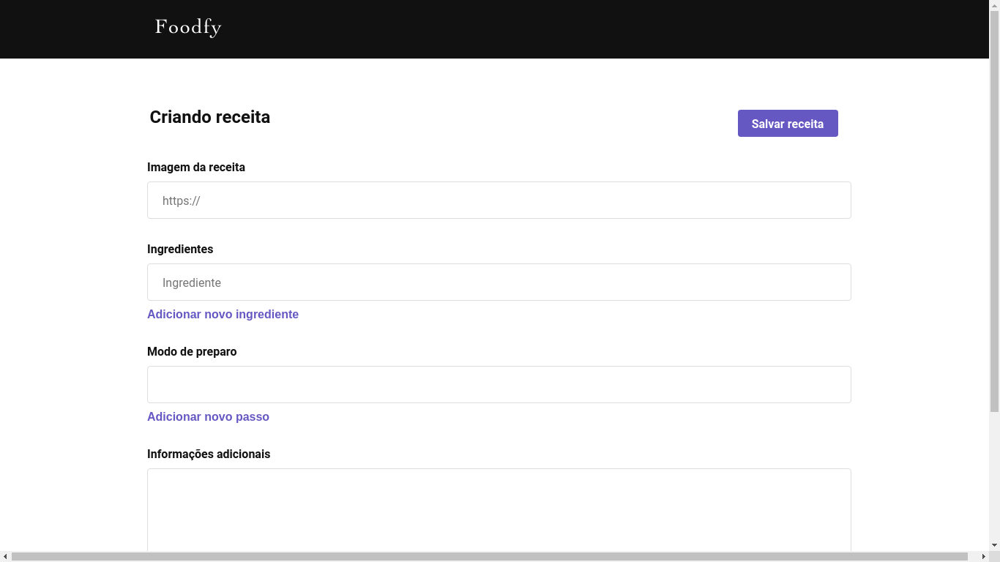
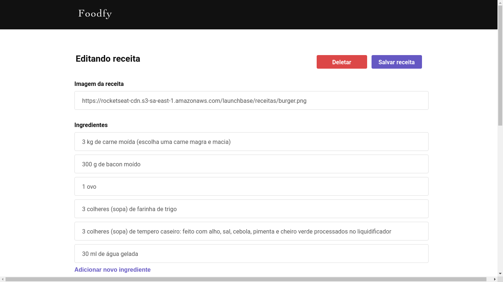

<h1 align="center">
    
</h1>

<h1>
    
</h1>

---

## 📖️ Sobre

O projeto **FoodFy** é um site de receitas, é possível criar, editar e deletar as receitas.

---

## 📋 Foodfy Admin 

   
   
   

---

## 🚀️ Tecnologias utilizadas

O projeto foi desenvolvido utilizando as seguintes tecnologias.

- HTML
- CSS
- JavaScript
- NodeJs
- Nunjucks
- Express

---

Desenvolvido por **Vinicius Hein**